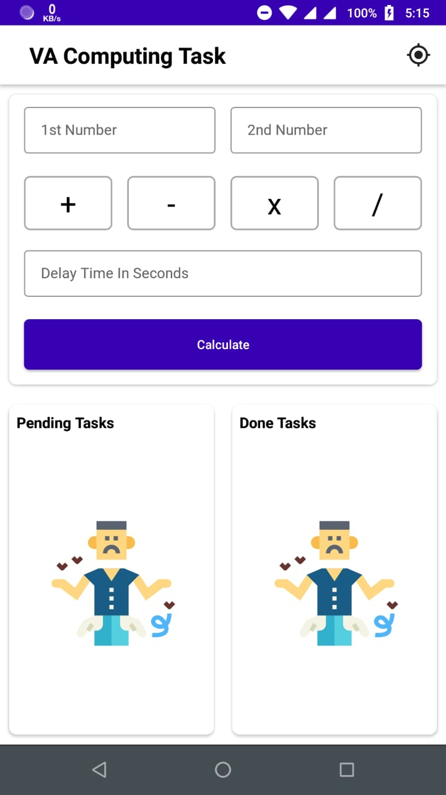
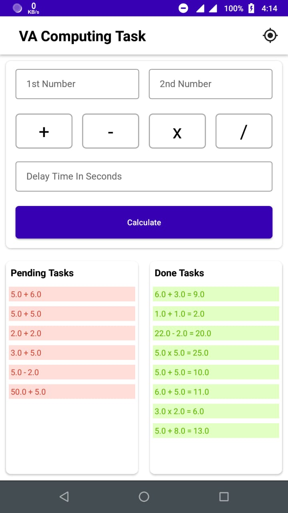

# VAComputingTask

<table>
  <tr>
    <td>Main Screen With No Data</td>
     <td>Main Screen With Data</td>
     <td>Location Screen</td>
  </tr>
  <tr>
    <td></td>
    <td></td>
    <td></td>
  </tr>
 </table>
